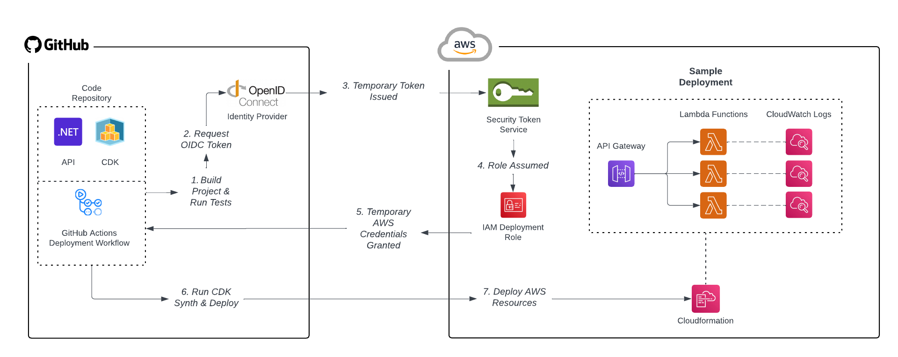

# Deployment Process

## Overview

This document outlines the detailed process for deploying code across the **development**, **test**, and **production** environments using **GitHub Actions**, **AWS CDK**, and **AWS CloudFormation**. The goal is to ensure that deployments are consistent, automated, and follow a structured workflow with proper validations and rollback mechanisms.

The deployment process covers:

- How deployments are triggered.
- Who is responsible for different steps in the process.
- What happens before, during, and after a deployment.
- Rollback strategies in case of issues.

---

## AWS Deployment Workflow Overview

The following diagram provides an overview of how our code moves from **GitHub** to **AWS**, showing how our **CI/CD process** uses **GitHub Actions**, **AWS CDK**, and **CloudFormation** to deploy applications and infrastructure automatically:

**Steps Explained**:

1. **Build and Test**: After a pull request is merged into `main`, the GitHub Actions pipeline runs the build and test process.
2. **OpenID Connect (OIDC)**: The GitHub Actions workflow requests an OIDC token from the identity provider for authentication with AWS.
3. **Temporary Token Issued**: AWS issues a temporary token via **Security Token Service (STS)** to authenticate the workflow.
4. **IAM Role Assumed**: GitHub Actions assumes an **IAM role** to gain permissions for deploying resources to AWS.
5. **Temporary AWS Credentials**: The workflow is granted temporary AWS credentials to perform actions within AWS.
6. **Run CDK Synthesis and Deployment**: **AWS CDK** synthesizes the CloudFormation templates and initiates the deployment process.
7. **Deploy AWS Resources**: Using the CloudFormation templates, AWS resources such as **Lambda functions**, **API Gateway**, and **CloudWatch Logs** are provisioned and deployed.

This diagram visually represents the flow of deployment tasks, which are described in more detail in the deployment stages below.

---

## Deployment Stages

### 1. Deployment to Development Environment

Deployments to the **development environment** are triggered automatically through the CI pipeline whenever changes are merged into the `main` branch.

#### Steps:

1. **Trigger**: After a pull request (PR) is merged into `main`, the GitHub Actions pipeline is triggered.
2. **Build and Test**: The application is built, and all tests (unit, integration, E2E) are run.
3. **AWS CDK Deployment**:
   - The pipeline assumes an AWS role for the **development account**.
   - AWS CDK provisions the necessary infrastructure and deploys the application to the development environment via CloudFormation.
4. **Smoke Testing**: Basic smoke tests are run in the development environment to ensure the deployment was successful.
5. **Feedback**: If the deployment or tests fail, feedback is provided to the development team for further action.

#### Who is involved:

- **Developers**: Responsible for managing the CI/CD pipeline, monitoring the deployment process, and resolving any issues that arise during deployment or testing.

---

### 2. Deployment to Test Environment

Deployments to the **test environment** are triggered manually when a release candidate is ready for testing.

#### Steps:

1. **Create a Release Candidate**: The development team drafts a release candidate on GitHub and tags it as a pre-release. Further details can be found in the [Release Process](release-process.md) guidance.
2. **Trigger the Test Deployment**: Once the release candidate is created, a manual deployment to the test environment is triggered via GitHub Actions.
3. **AWS CDK Deployment**:
   - The pipeline assumes an AWS role for the **test account**.
   - AWS CDK provisions the infrastructure and deploys the release candidate to the test environment via CloudFormation.
4. **Run Tests**:
   - Integration tests and smoke tests are re-run in the test environment.
5. **User Acceptance Testing (UAT)**:
   - The **Testing Team** performs UAT based on the test plan to validate the release candidate. They create and execute test plans to ensure the software meets the business requirements.
6. **Approval or Rollback**:
   - If the UAT passes, the release candidate is approved for production.
   - If issues arise, the team addresses the issues in the development environment and re-tests the release.

#### Who is involved:

- **Developers**: Responsible for creating the release candidate, deploying it to the test environment, and fixing any issues discovered during testing.
- **Testing Team**: Responsible for creating the UAT plan, conducting the UAT, and reporting any issues that need resolution.
- **Stakeholders**: May participate in reviewing the results of UAT and provide feedback or approval for the release candidate.

---

### 3. Deployment to Production Environment

Deployments to the **production environment** are triggered manually after a release candidate has passed all tests and UAT in the test environment.

#### Steps:

1. **Create a Production Release**: Once UAT is complete, the release candidate is finalized, and a production release is created and tagged in GitHub. Further details can be found in the [Release Process](release-process.md) guidance.
2. **Trigger the Production Deployment**: The deployment is triggered manually via GitHub Actions.
3. **AWS CDK Deployment**:
   - The pipeline assumes an AWS role for the **production account**.
   - AWS CDK provisions the infrastructure and deploys the release to production via CloudFormation.
4. **Smoke Testing**:
   - Basic smoke tests are run to verify that key functionalities are working in production.
5. **Post-Deployment Monitoring**:
   - Monitoring tools like AWS CloudWatch are used to track application performance and identify potential issues.
6. **Rollback Mechanism**:
   - If any critical issues are detected in production, the deployment is rolled back to the previous stable version automatically using AWS CloudFormation.

#### Who is involved:

- **Developers**: Manage the production deployment process, monitor the system post-deployment, and address any issues that arise during or after deployment.
- **Testing Team**: May assist in validating the final release, ensuring it matches the UAT expectations.
- **Stakeholders**: May validate the production release post-deployment to ensure it meets business requirements.

---

## Rollback Strategy

For every environment, we implement an automated rollback strategy in case the deployment encounters issues. This ensures that we can quickly revert to a stable state without manual intervention.

- **AWS CloudFormation Rollback**: If any deployment fails during the infrastructure provisioning, AWS CloudFormation automatically reverts the changes to the previous state.
- **Application Rollback**: In case of application issues, the GitHub Actions pipeline can be configured to roll back to the previous stable version of the application.

**Manual Intervention**: In cases where manual rollback is necessary (e.g., during production incidents), the DevOps team is responsible for initiating the rollback using the predefined rollback procedures.

In case of issues during deployment, follow the rollback mechanism described in the [Release Process](release-process.md) for reverting to the last stable release.

---

## Deployment Responsibilities

### Developers

- **Trigger Development Deployments**: Automatically triggered when merging pull requests.
- **Monitor Development Environment**: Ensure that development deployments are functioning as expected.
- **Draft Release Candidates**: When code is stable, create release candidates for testing.
- **Manage Test and Production Deployments**: Oversee deployments to test and production environments.
- **Fix Issues**: Resolve any issues that occur during testing, UAT, or production deployment.
- **Manage Rollbacks**: Handle any necessary rollbacks in the event of a deployment failure.

### Testing Team

- **Create UAT Test Plans**: Develop and execute test plans to ensure the software meets business requirements.
- **Conduct UAT**: Perform testing during UAT to validate the release candidate in the test environment.
- **Report Issues**: Provide detailed feedback on any issues found during UAT for the developers to resolve.

### Stakeholders

- **Provide Feedback**: Review UAT results and provide feedback.
- **Validate Production Release**: Provide final validation after the production deployment, if needed.

---

## Deployment Validation and Monitoring

For every deployment, the following validation and monitoring steps are performed:

- **Smoke Tests**: Automatically run smoke tests after each deployment to validate that critical functionality is working.
- **Monitoring Tools**: Use AWS CloudWatch or similar tools to monitor the health and performance of the application post-deployment.
- **Alerts**: Set up automatic alerts for any failures or performance degradations in the production environment.

---

## Tools and Technologies

- **GitHub Actions**: Used for automating the deployment process across environments.
- **AWS CDK**: Manages infrastructure as code for all environments (development, test, production).
- **AWS CloudFormation**: Used by AWS CDK to deploy and manage resources.
- **AWS IAM**: Manages access and roles for deployment to different environments.
- **Monitoring Tools**: AWS CloudWatch for performance monitoring and alerting.

---

This deployment process ensures that our applications are deployed consistently and reliably across all environments. With a strong focus on automation, validation, and rollback strategies, we reduce manual intervention and increase deployment confidence.
