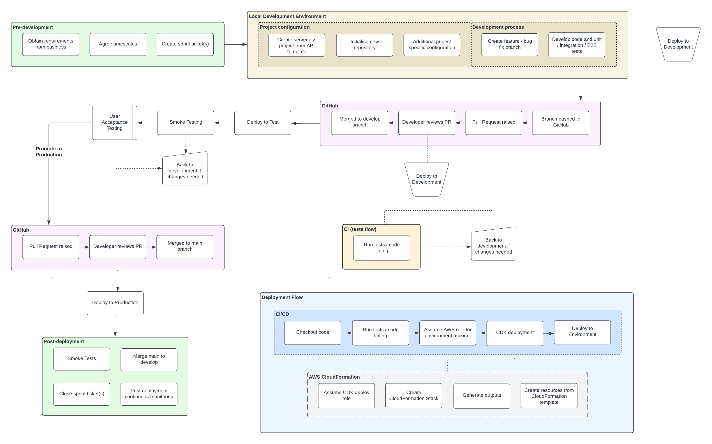

# Software Development Lifecycle

## Overview

The **Software Development Lifecycle (SDLC)** outlines the structured process our development team follows to ensure consistent, high-quality software delivery. This lifecycle guides our team from the initial gathering of requirements all the way through deployment and post-production monitoring. The process is designed to streamline workflows, maintain best practices, and enable continuous improvement through iteration.

The diagram below provides a visual representation of the SDLC stages our team follows:

---

## SDLC Stages

### 1. Pre-Development

The pre-development stage focuses on **gathering requirements** and defining the scope of the project before actual development work begins.

- **Key Activities**:
  - Obtain requirements from the business.
  - Define project scope and objectives.
  - Agree on timelines and set project milestones.
  - Create sprint tickets and organize them into the backlog for the development team.

This stage ensures that the project is properly scoped, and that all stakeholders are aligned on the goals before development begins.

---

### 2. Local Development Environment

Once the project is defined, development begins in a local environment. This is where the bulk of coding, testing, and iteration occurs.

- **Key Activities**:
  - Configure the project in a local environment, using templates and repositories.
  - Set up a new repository or initialize the project based on an API template.
  - Follow the branching strategy (e.g., GitHub Flow) by creating feature branches for development work.
  - Develop, code, and write unit tests, integration tests, and E2E tests.

During this stage, developers create and refine their code while continuously testing to ensure quality and adherence to best practices.

---

### 3. Continuous Integration (CI) and Development Pipeline

The CI pipeline automates the deployment of code to the **development environment** and runs automated tests to ensure that the code is functional and stable.

- **Key Activities**:
  - Code is merged into the `main` branch (after peer review and approval).
  - **CI/CD Pipeline** automatically runs tests (unit, integration, and E2E tests).
  - The AWS CDK (Cloud Development Kit) is used to deploy the infrastructure and application to the development environment.
  - Run smoke tests to verify the deployment.
  - If tests fail, the code is sent back to development for further changes and fixes.

This stage ensures that all code changes are continuously integrated into the system and validated with automated testing, reducing the risk of errors later in the process.

---

### 4. Create a Release

After the development environment passes all tests, a release branch is created and prepared for deployment to the **test environment**.

- **Key Activities**:
  - Create a release branch.
  - Name the branch using **semantic versioning** (e.g., `release/v1.0.0`).

The release serves as a version of the application that is ready for testing, ensuring that it meets the necessary quality and functional requirements.

---

### 5. Testing and Deployment to Test Environment

Once a release is ready, it’s deployed to the **test environment** for thorough validation, including **User Acceptance Testing (UAT)**.

- **Key Activities**:
  - Deploy the release to the test environment using AWS CDK and CloudFormation.
  - Run integration and smoke tests in the test environment to validate the deployment.
  - **UAT**: The testing team and stakeholders validate the release to ensure it meets business requirements.
  - If any issues arise during testing, changes are sent back to development for fixes and re-deployment.

This stage ensures that the application is tested in an environment that closely mirrors production, reducing the risk of issues in production.

---

### 6. Deployment to Production

Once the release has passed testing, it is prepared for deployment to the **production environment**.

- **Key Activities**:
  - Promote the release to production by tagging it for production deployment.
  - Deploy the application to production using AWS CDK and CloudFormation.
  - Run post-deployment **smoke tests** to ensure the application is functioning correctly in the production environment.

At this stage, the application goes live, and users can begin interacting with it.

---

### 7. Post-Production Monitoring and Feedback

After deployment to production, the application is continuously monitored to ensure stability, performance, and reliability.

- **Key Activities**:
  - Use AWS CloudWatch to monitor application performance, detect any potential issues, and set up alerts for critical errors.
  - Merge the release branch into `main` so any changes made during UAT are synced.
  - If any issues arise, the development team can roll back to a previous stable version or issue hotfixes.
  - Sprint tickets are closed, and feedback from stakeholders is gathered for future iterations.

The post-production stage ensures that any issues are caught early and addressed quickly, allowing for continuous improvement.

---

## Conclusion

The Software Development Lifecycle (SDLC) is designed to ensure that every step, from planning to production, follows a structured, consistent process. By following these stages, our team can deliver high-quality software while continuously improving through feedback and monitoring.

For more details on specific stages like **CI/CD**, **Testing**, and **Deployment**, refer to the related sections in this playbook.
